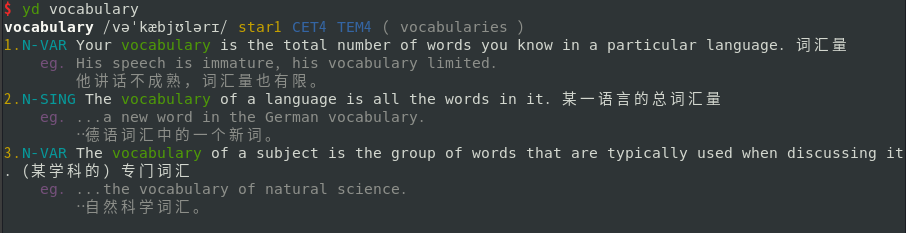

# Python_tools
该工程中包含多个可以独立使用的小工具，具体每个工具的使用如下。
## yd.py
### 功能特点
在终端中查询单词的柯林斯词典，词典数据来源为有道网页词典中的柯林斯词典。
### 使用
1. 下载工程
```sh
git clone https://github.com/vhqkze/Python_tools.git
```
1. 在`/usr/local/bin/`中创建`yd.py`的软链接
```bash
sudo ln -s /pathtoyourfile/Python_tools/yd.py /usr/local/bin/yd
```
2. 在终端中就可以直接使用`yd word`查询单词了。

3. 与`bat`集成，在`~/.zshrc`文件末尾加上以下内容，然后使用`source ~/.zshrc`命令：
```
yd() {/usr/local/bin/yd "$1" | bat -p}
```
### 依赖
- Python 3.6+
- Python packages:
    - requests
    - beautifulsoup4
